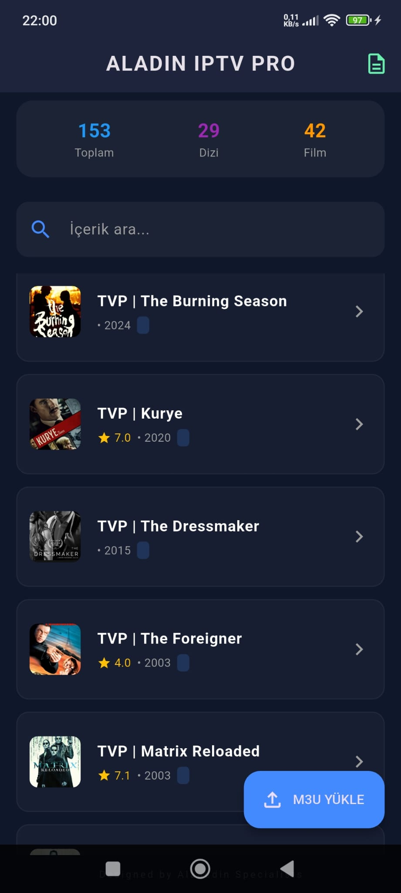
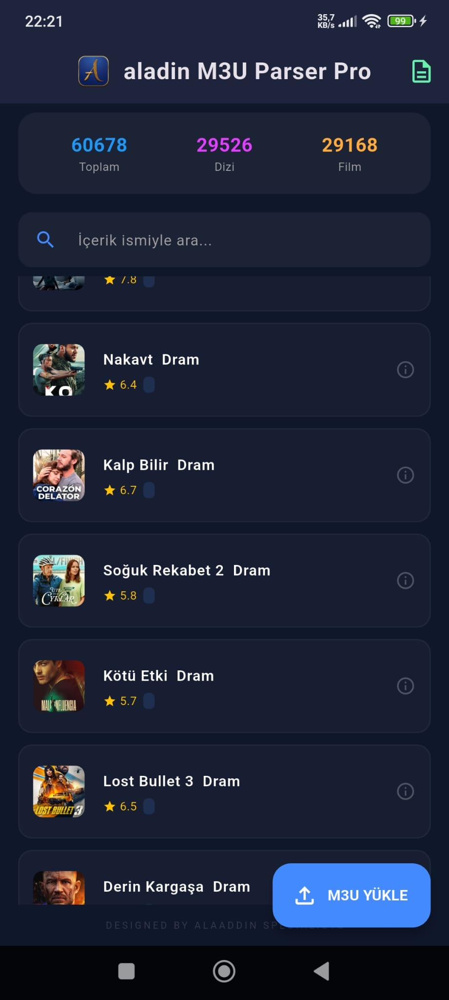
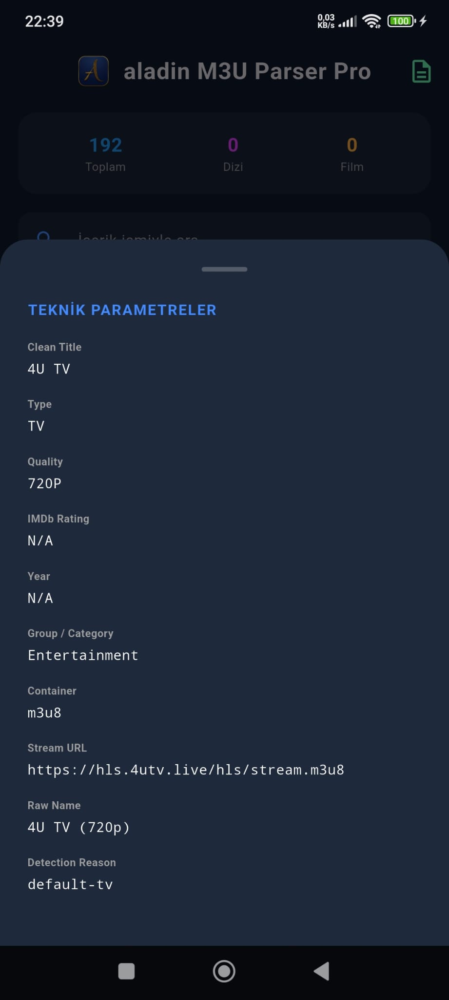

# AladinM3UParserService — Technical Documentation (V4.0)

## Screenshots

  
  
  

## 0. Overview
This service is a high-performance M3U playlist engine built with Flutter. It iterates through raw M3U data to extract, clean, and categorize content into a structured data model. The parser is designed for data mining and advanced metadata enrichment.

### Key Data Fields Generated:
- **aladinRawName**: The original `tvg-name` attribute (preserved for API syncing).
- **aladinTitle**: Cleaned title optimized for UI display.
- **aladinRating**: Extracted IMDb scores.
- **aladinYear**: Production year identified through strict regex patterns.
- **aladinQuality**: Normalized quality tags (e.g., 4K, HEVC).
- **aladinType**: Automatic classification: `tv`, `movie`, or `series`.
- **aladinSeason / aladinEpisode**: Logical mapping of season/episode numbers or air dates.
- **aladinContainer**: Stream format detection (mkv, mp4, m3u8, etc.).

---

## 0.5 DOWNLOAD APK
[**Download Latest APK**](https://github.com/tezalaaddin/aladin-m3u-parser-pro/releases/latest)

## 1. Hybrid Metadata Extraction Strategy
The engine utilizes a **Hybrid Source** approach. Instead of scanning only the visible title, it combines the `tvg-name` attribute and the raw display name.
- **Logic:** `metaSource = "$tvgNameAttr | $rawNameOriginal"`
- **Benefit:** Captures hidden metadata (like IMDb ratings) that providers often embed in attributes rather than the visible text.

---

## 2. Advanced Content Classification (Type Decision Tree)
The parser classifies content using a multi-layered heuristic:
- **SERIES**: Triggered if the URL contains `/series/`, if the name matches `Sxx Exx` patterns, or if the `DIZI` prefix is detected.
- **MOVIE (VOD)**: Triggered by `/movie/` URL segments or standard video file extensions (.mkv, .mp4, .avi).
- **TV**: Default fallback for live broadcast channels.

---

## 3. Turkish Broadcast "DIZI" Prefix Logic
Designed specifically for archive/catch-up services:
- **Format:** `DIZI [CHANNEL] : [SHOW NAME] ([DATE])`
- **Result:** Extracts the show name as the series title, identifies the full date as the episode identifier, and pulls the year from the date string.

---

## 4. Quality Tag Normalization
To ensure a consistent UI, scattered tags are collected and re-ordered by priority:
- **Sort Order:** `HEVC > 4K > UHD > FHD > 1080P > HD+ > HD > 720P > SD > 60FPS > 50FPS`
- **Example:** `FHD 60FPS HEVC` is automatically standardized to `HEVC FHD 60FPS`.

---

## 5. Architecture: Multithreaded Processing (Isolates)
Processing massive M3U files (50,000+ lines) can freeze the application. 
- This service utilizes Flutter’s `compute()` function to run heavy Regex operations in a background **Isolate**.
- **Result:** The UI remains smooth and responsive during the parsing process.

---

## 6. Container & Stream Detection
The parser strips query parameters (tokens/IDs) to accurately identify the underlying stream container. This allows the player to pre-determine the necessary codecs before the stream starts.

---

## Summary of Features
| Feature | Implementation | Goal |
| :--- | :--- | :--- |
| **Title Cleaning** | Recursive Regex | Removes years/tags for a clean UI. |
| **IMDb Extraction** | Greedy Pattern Matching | Captures ratings from any position. |
| **Data Integrity** | aladinRawName Mapping | Keeps original tags for database consistency. |
| **Reporting** | Excel Export Service | Generates data-mining ready reports. |
